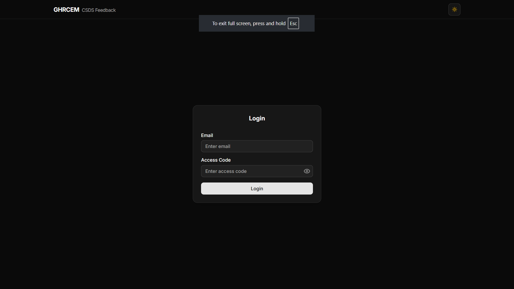
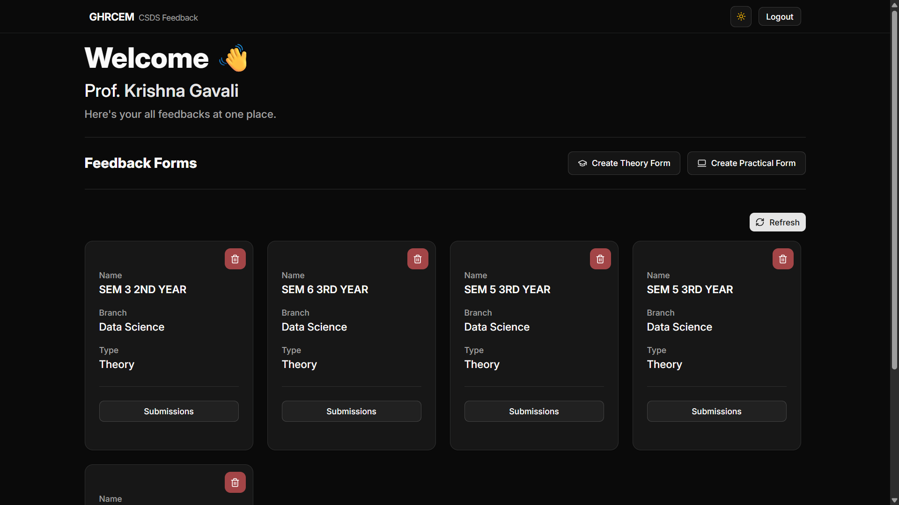
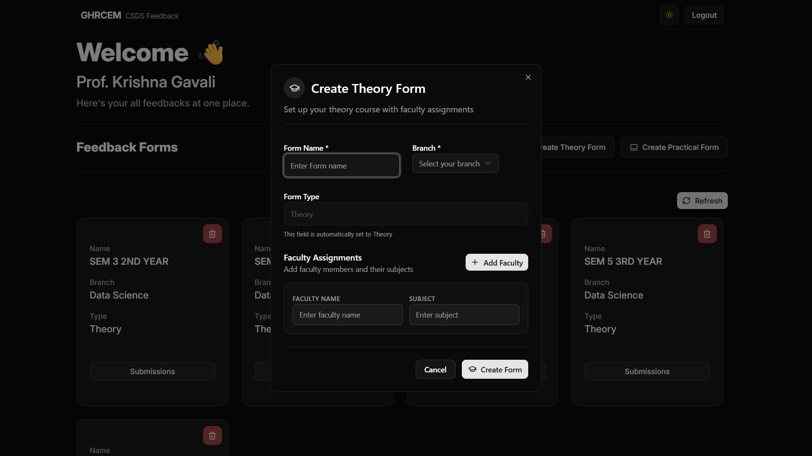
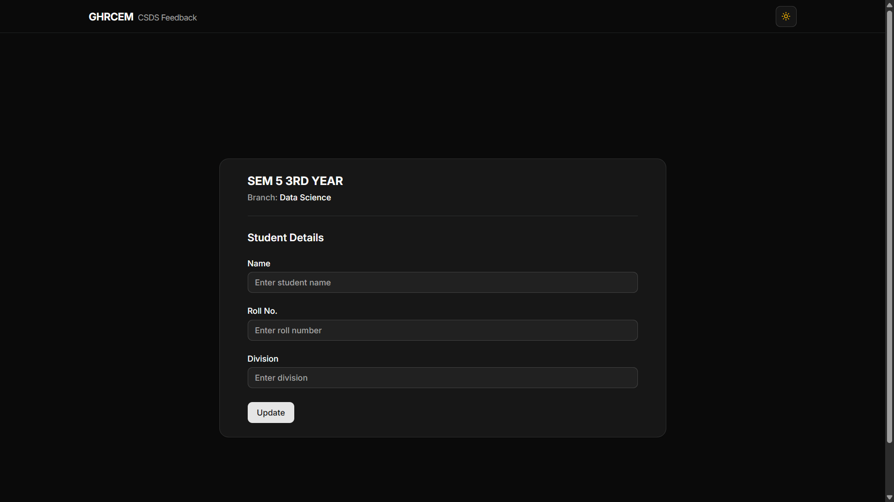
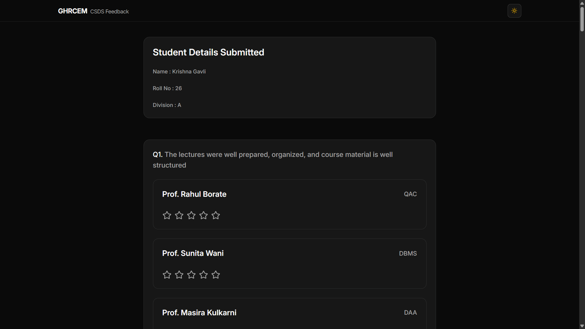
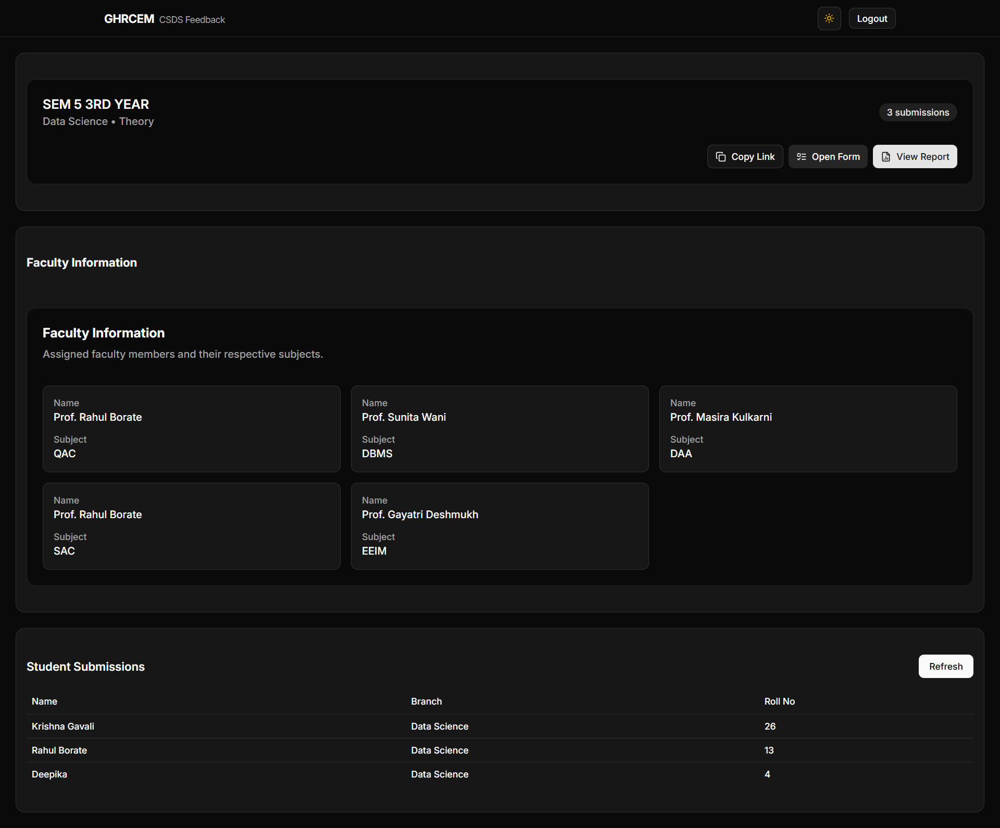
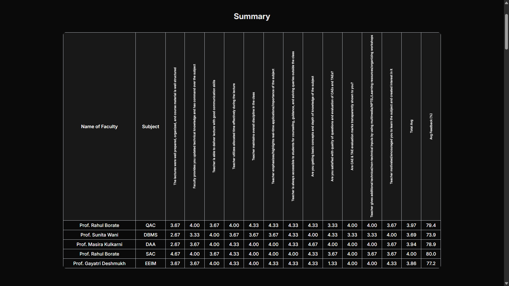
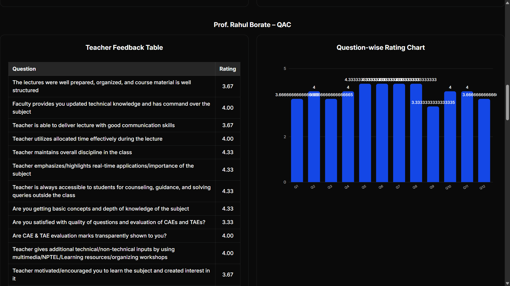

# GHRCEM CSDS Feedback System 🎓

**A feedback management system I built for my college that saves faculty 8+ hours every semester**

  

---

## What's this about?

So here's the thing - My professor told me he spends hours every semester creating the same Google Forms for student feedback. He has to make forms for 6 different classes, each with the same 12 questions but different teacher names and Subject. Takes him about 8 hours total.

I thought, "There's gotta be a better way to do this," and built a system that does it all in 30 seconds.

## The problem (and why I cared)

**Before my system:**

- Faculty spent 8+ hours per semester just creating forms
- Same questions, different teacher names - super repetitive
- Responses scattered across multiple Google Forms
- No way to see trends or get insights
- Manual work to compile everything for reviews

**After building this:**

- Generate complete forms in 30 seconds
- All responses in one place
- Real-time analytics and insights
- Department-wide efficiency improvement

## How it started

My professor called me up and said, "This feedback form creation is really hectic. I've been building these forms for the past 3 days. Can you help?"

That's when it hit me - this is definitely a problem worth solving. So I built something that the entire department could use.

When I showed it to our HOD, she was genuinely impressed (surprising since I'm usually on her not-so-good list 😅). Now they're thinking about rolling it out department-wide.

Planning to pitch this to other departments too - fingers crossed! 🤞

## What it does

**For Teachers:**

- Create feedback forms by just entering name, subject, branch, year
- Watch student submissions come
- Get analytics on feedback trends
- Share forms with students via unique links

**For Students:**

- Fill forms quickly on any device
- No registration needed - just click and submit
- Clean, simple interface

## Tech stuff

- **Frontend:** React (because it's what I'm comfortable with)
- **Backend:** Appwrite (free tier friendly)
- **Database:** Appwrite database
- **Hosting:** Vercel (free and fast)
- **Auth:** Simple email-based login (Appwrite Auth)

Nothing too fancy - I wanted to build something that actually works and doesn't cost money to run.

## Screenshots

### Login page

### Teacher dashboard - where the magic happens

### Creating a new form (30 seconds, I promise)

### What students see when filling feedback

### Teachers can see all submissions

### Analytics and reports

_Yeah, I know the reports UI looks pretty basic, but there's a reason for that! The professor specifically wanted these pages to be print-friendly for college paperwork. So I had to keep the design simple and clean for PDF printing. Trust me, I can build way better-looking dashboards when I don't have to worry about print layouts! 😅_

## Why I'm proud of this

- **Actual impact:** Saving real people real time every semester
- **Real users:** Faculty are actually using this (or will be soon)
- **Problem-solving:** Saw a bigger picture from one person's complaint
- **Scalable thinking:** Built for one professor, designed for the whole department

## What's next?

- Maybe expand to other departments if this works well 🏬
- Get this running on college sub-domain will be cool 😎

## Random thoughts

This project taught me that sometimes the best ideas come from people complaining about their daily problems. My professor's frustration became my opportunity to build something meaningful.

Also learned that building for real users (who will actually tell you when something sucks) is way different than building pet projects that only you see.

---

**Built by Krishna Gavali** | Data Science Student | GHRCEM

_If you're working on similar stuff or want to chat about this project, feel free to reach out!_
